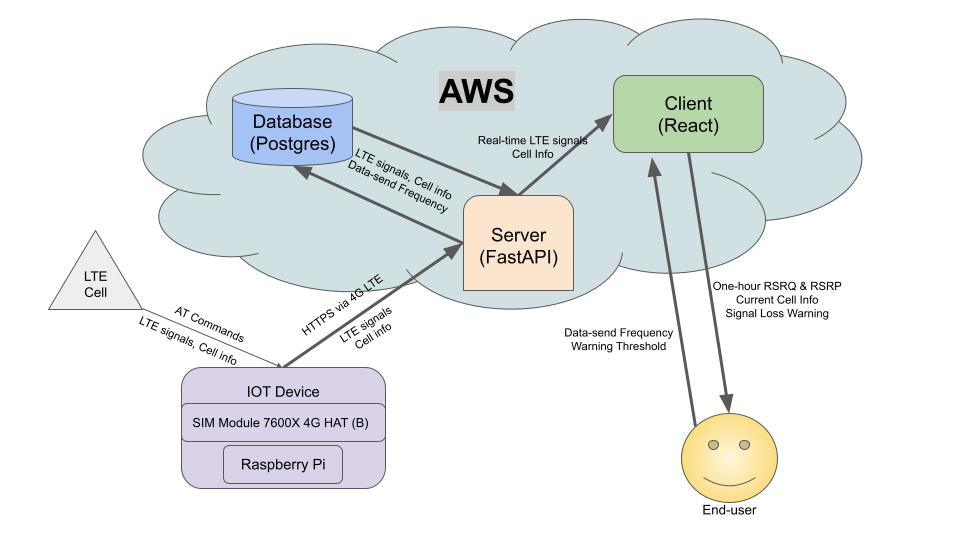

## junctionx-hanoi-2023-iot-newbees
This is a part of the work for the [JunctionX Hanoi 2023 Hackathon](https://www.junctionxhanoi2023.com/).<br>
- Team: **NEWBEES**<br>
- Competition description: Within 48 hours, set up an IoT system to detect weak/loss of LTE 4G signal.
- Submitted product: see the entire system architecture in image below.<figure>
  <a href="https://docs.google.com/presentation/d/1SUfOoXLpWCnfktmx_Bo7HddxW_Sc9susIa3Cdxdg0OA/edit?usp=sharing">
    
  </a>
</figure>

- Repo description: Set up client.
  - Server repo: [link to GitHub Repo](https://github.com/hoangnguyen719/iot-lte-supervisor-server)
- Final presentation
  - PowerPoint Slides: [link to Google Drive](https://docs.google.com/presentation/d/1bPi0vrQAUJJFnyKqWmuZRpBibypFUIaYIDAKa4smMN4/edit?usp=sharing)
  - Full presentation: [link to Facebook video](https://fb.watch/j-aidbyJQP/) (from **02:03:20** to **02:23:41**)

----

This is a [Next.js](https://nextjs.org/) project bootstrapped with [`create-next-app`](https://github.com/vercel/next.js/tree/canary/packages/create-next-app).

## Getting Started

First, run the development server:

```bash
npm run dev
# or
yarn dev
```

Open [http://localhost:3000](http://localhost:3000) with your browser to see the result.

You can start editing the page by modifying `pages/index.js`. The page auto-updates as you edit the file.

[API routes](https://nextjs.org/docs/api-routes/introduction) can be accessed on [http://localhost:3000/api/hello](http://localhost:3000/api/hello). This endpoint can be edited in `pages/api/hello.js`.

The `pages/api` directory is mapped to `/api/*`. Files in this directory are treated as [API routes](https://nextjs.org/docs/api-routes/introduction) instead of React pages.

## Learn More

To learn more about Next.js, take a look at the following resources:

- [Next.js Documentation](https://nextjs.org/docs) - learn about Next.js features and API.
- [Learn Next.js](https://nextjs.org/learn) - an interactive Next.js tutorial.

You can check out [the Next.js GitHub repository](https://github.com/vercel/next.js/) - your feedback and contributions are welcome!

## Deploy on Vercel

The easiest way to deploy your Next.js app is to use the [Vercel Platform](https://vercel.com/new?utm_medium=default-template&filter=next.js&utm_source=create-next-app&utm_campaign=create-next-app-readme) from the creators of Next.js.

Check out our [Next.js deployment documentation](https://nextjs.org/docs/deployment) for more details.
